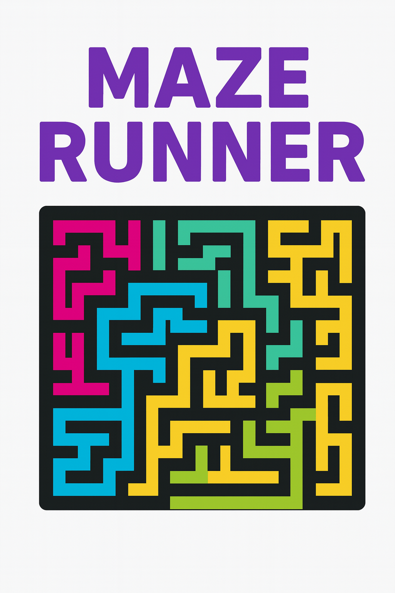
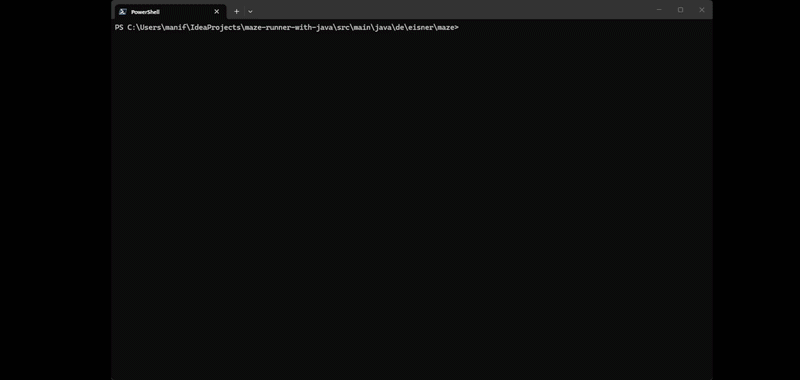

# Maze Runner

German

Dieses Programm ist ein interaktiver Labyrinth-Simulator für die Konsole. Es ermöglicht das Erzeugen von komplexen Labyrinthen mittels prozeduraler Generierung, das Speichern und Laden von Clustern sowie einen interaktiven "Runner-Modus", in dem der Benutzer das Labyrinth selbst durchqueren kann.

## Zu der App

* ***Konsolen-Anwendung*** mit interaktivem Menü und ANSI-Farbdarstellung.
* ***Prozedurale Generierung:*** Nutzt einen modifizierten Prim-Algorithmus, um perfekte Labyrinthe zu erstellen, die garantiert einen Pfad zwischen Eingang und Ausgang besitzen.
* ***Breadth-First Search (BFS):*** Ein integrierter Pathfinding-Algorithmus berechnet bei Bedarf den kürzesten Weg zum Ziel.
* ***Interaktiver Runner:*** Bewege den Charakter **O/** mit `WASD` durch das Labyrinth. Die Konsole wird dabei in Echtzeit neu gerendert.

***Kernfunktionen:***

* Generieren von Labyrinthen mit benutzerdefinierten Dimensionen.
* Speichern und Laden von Labyrinthen als Textdateien.
* "Run the Maze"-Modus mit Echtzeit-Eingabe und Ziel-Animation.
* Automatisches Finden des Ausgangs.

## Programmablauf

## Wie kann ich diese testen?

1. **Repository klonen:**
`git clone git@github.com:Dima0687/maze-runner-with-java.git`
2. In einer IDE öffnen (z.B. IntelliJ IDEA).
3. **Ausführung:**
  Führe die `App`-Klasse im Paket `de.eisner.maze` aus.
4. **Bedienung:**
    * Wähle **1**, um ein Labyrinth zu generieren (z.B. 25 30 eingeben).
    * Wähle **5**, um dir den Lösungsweg anzeigen zu lassen.
    * Wähle **6**, um den Runner-Modus zu starten. Steuerung mit `W, A, S, D`. Drücke **0**, um zum Menü zurückzukehren.

## Fazit

Die größte Herausforderung in diesem Projekt lag in der präzisen Implementierung des BFS-Algorithmus und des Randomized Prim Algorithmus. Während die theoretischen Konzepte dahinter schnell greifbar waren, erwies sich die fehlerfreie Überführung in funktionalen Code als zeitintensiv und fordernd. Rückblickend war die Gestaltung der Software-Architektur diesmal deutlich leichter als in vorangegangenen Projekten, was eine positive Lernkurve im Bereich Clean Code und Design-Patterns bestätigt.

Das Projekt war eine Achterbahnfahrt aus Erfolgserlebnissen und Frustmomenten, besonders wenn vermeintlich einfache Logiken nicht sofort funktionierten. Nach über ***260 Tagen ununterbrochenem Lernen*** war dies ein intensiver Abschluss, der zeigt, dass Wissen Zeit zum "Sacken" braucht.

**Hinweis zum Umfang:**
Dieses Projekt basiert auf einem Hyperskill-Szenario. Während dort lediglich die Anforderungen für die Stufen 0 bis 5 (*Generierung, I/O, Pathfinding*) gefordert waren, wurde ***Stufe 6 (der interaktive Runner-Modus)*** als zusätzliche Eigenleistung implementiert, um die Anwendung von einer reinen Logik-Übung in ein echtes Minispiel zu verwandeln.

 
 

English

This is an interactive maze simulator for the console. It allows for the creation of complex mazes using procedural generation, saving and loading of maze data, and an interactive "Runner Mode" where the user can manually traverse the maze.

## About the App

* **Console application** with an interactive menu and ANSI color rendering.
* **Procedural Generation:** Uses a modified Prim's algorithm to create perfect mazes with
  guaranteed paths between entry and exit.
* **Breadth-First Search (BFS):** An integrated pathfinding algorithm calculates the shortest path 
  to the goal on demand.
* **Interactive Runner:** Move the character O/ through the maze using WASD. The console re-renders 
  in real-time.
**Data Integrity:** Utilizes Deep Copy techniques to ensure path calculations do not mutate the 
  original maze grid, keeping game logic and algorithms separate.

**Key Features:**

* Generating mazes with custom dimensions.
* Saving and loading mazes as text files.
* "Run the Maze" mode with real-time input and goal animations.
* Automated escape route finding if the player gets lost.

## Program Flow

## How can I test this?

1. **Clone the repository:**
`git clone git@github.com:Dima0687/maze-runner-with-java.git`
2. Open in an IDE (e.g., IntelliJ IDEA).
3. **Execution:**
  Run the `App` class in the `de.eisner.maze` package.
4. **Usage:**
    * Press **1** to generate a maze (e.g., enter 20 20).
    * Press **5** to find the solution path.
    * Press **6** to start Runner Mode. Control with `W, A, S, D`. Press **0** to return to the menu.

## Conclusion

The main challenge of this project was the precise implementation of the ***BFS algorithm*** and ***Randomized Prim's algorithm***. While the theoretical concepts were easy to grasp, translating them into bug-free, functional code proved to be time-consuming and demanding. On a positive note, designing the software architecture felt much more intuitive this time compared to previous projects, confirming a solid growth in understanding clean code and design patterns.

The development process was a mix of rewarding "aha!" moments and periods of frustration, especially when simple logic didn't work as expected. Having studied for ***260 consecutive days***, this project was an intense milestone that highlighted the importance of giving the mind time to process and solidify complex information.

**Note on Scope:**
This project is based on a Hyperskill track. While the official requirements only covered stages 0 to 5 (*Generation, I/O, Pathfinding*), ***Stage 6 (the interactive Runner Mode)*** was implemented as an additional feature to evolve the application from a pure logic exercise into a functional mini-game.

 
 

